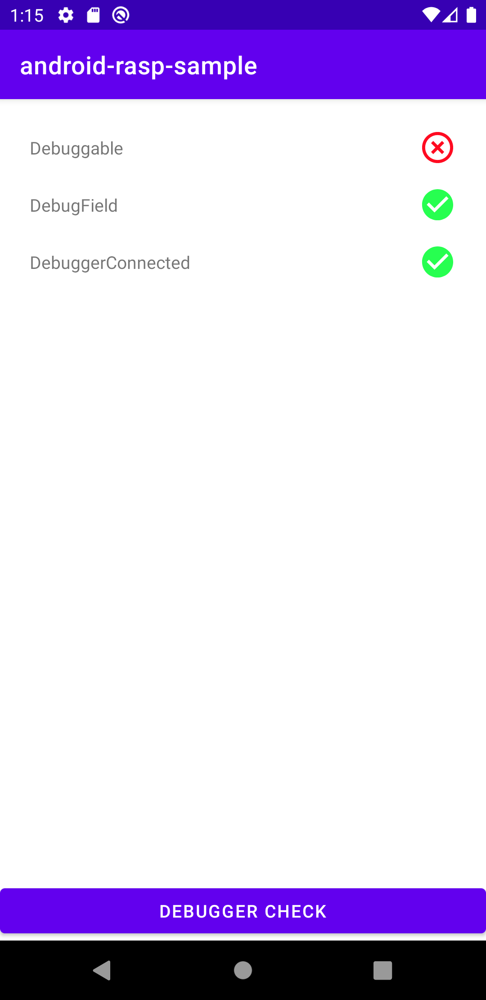

# Android RASP

[](https://github.com/securevale/android-rasp/actions/workflows/ci.yml)
[](https://kotlinlang.org/docs/whatsnew19.html)
[](https://developer.android.com/about/versions/nougat)
[](https://developer.android.com/about/versions/15)
[](https://docs.gradle.org/8.11.1/release-notes.html)
[](https://search.maven.org/artifact/com.securevale/rasp-android)

An open-source RASP (Runtime Application Self-Protection) solution for protecting Android apps
against being run on vulnerable devices.

> [!NOTE]  
> Android RASP is still in development, meaning that some breaking changes are likely to
> be introduced in future releases.
> See [Versioning](#versioning) section for more information.

## Motivation

In the current threat-rich environment, it is crucial to protect the apps against exploitation of a
wide range of vulnerabilities and reverse engineering techniques. Hooking frameworks,
man-in-the-middle attacks, app repackaging, rooted devices, just to name a few common threats
applicable to mobile applications.

While there are existing solutions for guarding against aforementioned threats, almost all of them
are paid. This library is one attempt to provide a robust solution for "regular" teams and devs that
cannot afford spending hundreds of dollars per month to defend against this kind of threats,
allowing to take control over application execution, security threat detection, and real-time attack
prevention.

> [!NOTE]  
> While adopting this library will shield your app against a number of runtime security threats, 
> you need to remember that no security measure can ever guarantee absolute security. 
> Any motivated and skilled enough attacker will eventually bypass all security protections.
> For this reason, **always keep your threat models up to date**.

## Getting started

First ensure that you have defined `mavenCentral` in your Gradle configuration.

```groovy
repositories {
    mavenCentral()
}
```

Next, add Android RASP library as a dependency to your project.

```groovy
dependencies {
    implementation 'com.securevale:rasp-android:{version}'
}
```

Before first use, the library needs to be initialised with `init()` method. This method is 
expected to be called only once per app's lifecycle, so the best place for doing it is inside 
of your app's `Application` class.

```kotlin
import com.securevale.rasp.android.SecureApp

class SampleApplication : Application() {

    override fun onCreate() {
        super.onCreate()
        SecureApp.init()
    }
}
```

Then, create a `builder` with the desired configuration options.

```kotlin
import com.securevale.rasp.android.emulator.CheckLevel
import com.securevale.rasp.android.api.SecureAppChecker

val shouldCheckForEmulator = true
val shouldCheckForDebugger = true
val shouldCheckForRoot = true

val builder = SecureAppChecker.Builder(
  this,
  checkEmulator = shouldCheckForEmulator,
  checkDebugger = shouldCheckForDebugger,
  checkRoot = shouldCheckForRoot
)
```

Use the `builder` to create the RASP checks and trigger them to obtain the result.

```kotlin
import com.securevale.rasp.android.api.result.Result

val check = builder.build()
val checkResult = check.check()

when (checkResult) {
    is Result.EmulatorFound -> {} // app is most likely running on emulator
    is Result.DebuggerEnabled -> {} // app is in debug mode
    is Result.Rooted -> {} // app is most likely rooted
    is Result.Secure -> {} // OK, no threats detected
}
```

You can also perform more granular checks.

```kotlin
val check = builder.build()
check.subscribe {
    // examine result(s) here
}
```

Or even subscribe in order to be notified only when a potential threat is detected.

```kotlin
val check = builder.build()
check.subscribeVulnerabilitiesOnly(granular = true) {
  // examine result(s) here
}
```

You can also choose which checks should be run by passing appropriate list to
the `checkOnlyFor` parameter.

```kotlin
import com.securevale.rasp.android.api.result.DebuggerChecks
import com.securevale.rasp.android.api.result.EmulatorChecks
import com.securevale.rasp.android.api.result.RootChecks

val check = builder.build()
check.subscribeVulnerabilitiesOnly(
  granular = true,
  checkOnlyFor = arrayOf(
    EmulatorChecks.AvdDevice,
    EmulatorChecks.AvdHardware,
    EmulatorChecks.Genymotion,
    EmulatorChecks.Nox,
    DebuggerChecks.Debuggable,
    DebuggerChecks.DebugField,
    RootChecks.SuUser,
    RootChecks.TestTags,
    RootChecks.RootApps,
    RootChecks.RootCloakingApps,
    RootChecks.WritablePaths,
    RootChecks.SuspiciousProperties
  )
) {
  // examine result(s) here
}
```

For more information about available configuration options, see
[SecureAppChecker](https://github.com/securevale/android-rasp/blob/master/rasp/src/main/java/com/securevale/rasp/android/api/SecureAppChecker.kt)
class documentation.

> [!IMPORTANT]
> A skilled attacker might be able to repackage protected app and remove the checks from
> the source code.
> With that said, it is highly recommended to add these checks in multiple places in code, so as to
> maximize the cost and effort required to successfully bypass all the checks.
> Additionally, in order to further impede the malicious actors' life, the library checks are
> written
> in native code (using Rust language) and distributed with library source code as `.so` library files.

## Supported Checks

### Debugger Detection

Includes:

- Several checks for debug flags;
- Check for connected debugger;
- Check for threads waiting for the debugger to be attached.

### Emulator Detection

Includes:

- Check for "basic" emulator indicators (mostly device build configuration
  fields indicating whether particular device is "real" or not). These fields can be easily faked by
  the emulator makers or even by the device user (if the device happens to be rooted);
- More advanced checks (such as device's operator name, telephone number, properties etc.). 
  Recommended when you need to be more certain whether the device is an
  emulator. Please note that in order to take full advantage of these checks, you need to add
  *android.permission.READ_PHONE_STATE* permission to your application manifest file.

All implemented checks were tested on various emulators and devices to decrease both false-positives (
when device that is not an emulator is reported as one) and false-negatives. However, as the detection
techniques become more advanced, the emulator detection bypass tools are improving as well. This is a
never ending cat and mouse game, so there is no guarantee that all emulators will be correctly and
accurately reported as such. The library shall be continuously updated with new emulator detection
techniques with the aim of catching the emulators that slip through the existing checks.

### Root Detection

Includes:

- Checks for superuser indicators;
- Checks for test tags present on device;
- Checks for rooting and root cloaking apps (currently in beta);
- Checks for paths that should not be writable;
- Checks for suspicious properties;

>[!IMPORTANT]
> Rooting is an ever-evolving domain and so are the root detection techniques. For this reason it is important to understand that the above checks are not exhaustive and
> should be expected to undergo continuous improvement.

> [!NOTE]
> Although some basics checks for Magisk are already in place, a comprehensive Magisk detection is expected to be implemented in future releases.

## ProGuard

Android RASP ships with its own ProGuard rules, except one caveat regarding the `DebugField`
check. The library relies on `BuildConfig` class which needs to be excluded from obfuscation. In order
for this check to return correct results, add the following line to your ProGuard configuration file:

```
-keep class {your_package}.BuildConfig{ *; }
```

Alternatively, you can opt out from this check by excluding `DebugField` from an array of checks passed to 
`checkOnlyFor` parameter.


## Package visibility changes Android 11+

Android 11 introduced [changes related to package visibility](https://developer.android.com/about/versions/11/privacy/package-visibility). Android RASP contains several checks which
utilize knowledge about suspicious packages installed on a device. This checks might not work when run on a device running
on Android 11+, it will not crash the app but will not be able to properly check for suspicious packages occurrence thus
reporting device being safe while it might not be.

The library is checking for [packages defined here](https://github.com/securevale/android-rasp/blob/master/native/src/common/package.rs).

In order to address this changes and make sure that library is able to check all suspicious packages the additional,
optional library with the manifest was added with manifest which defines all of packages Android RASP is asking as
a queryable.

```groovy
dependencies {
    implementation 'com.securevale:rasp-packages:{version}'
}
```

> [!NOTE]
> You are adding it an your own risk as Google's privacy policies are constantly changing and it's not guaranteed that requesting such a wide list of queryable packages
> won't result in app being pulled off/rejected from the Google Play Store.

> [!NOTE]
> Although package checks might not work perfectly, Android RASP performs many other security checks.
> So even without using the optional `rasp-packages` library, you can still expect the main library to
> fulfill its security assessment promises.

## Sample app

Sample allows you to test checks. To run it you need to clone the project and build and run "sample-app" 
project on device of your choice.



## Versioning

This project follows [semantic versioning](https://semver.org/). While still in major version `0`,
source-stability is only guaranteed within minor versions (e.g. between `0.3.0` and `0.3.1`). If you
want to guard against potentially source-breaking package updates, you can specify your package
dependency using exact version as the requirement.

## License

This tool and code is released under Apache License v2.0 with Runtime Library Exception. Please
see [LICENSE](LICENSE) for more information.